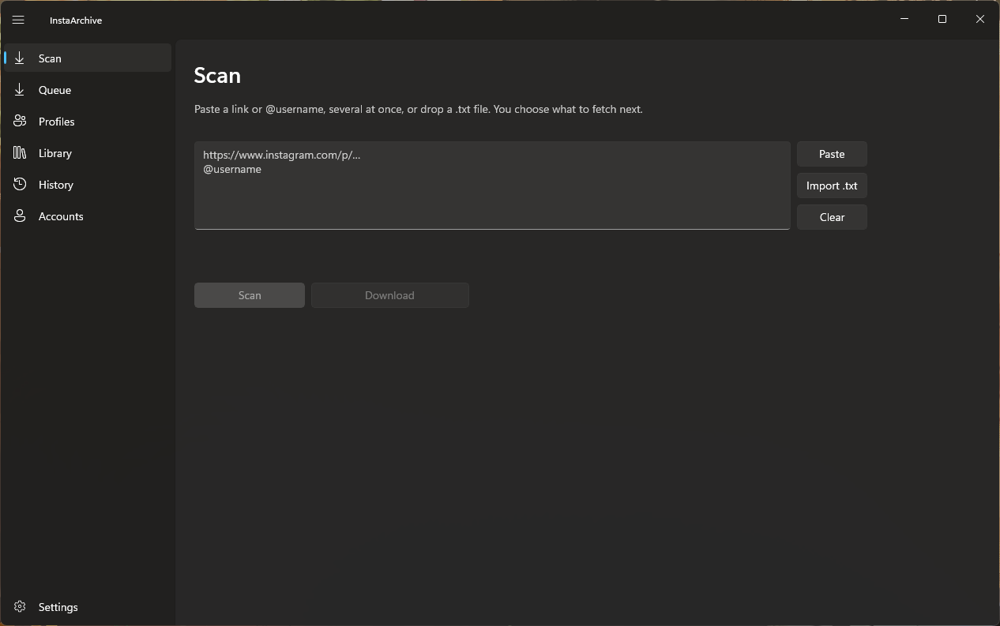
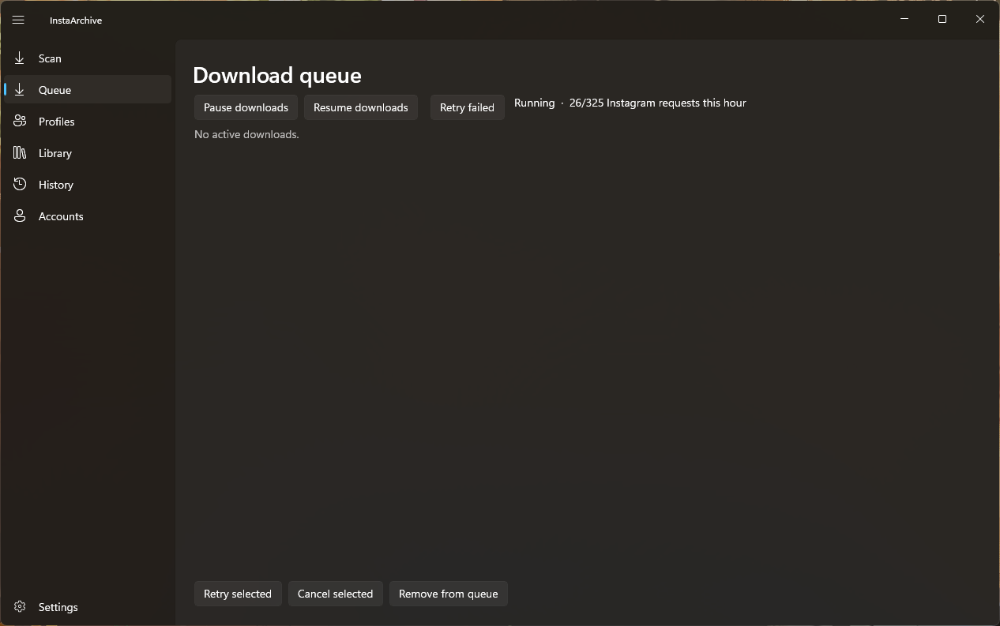
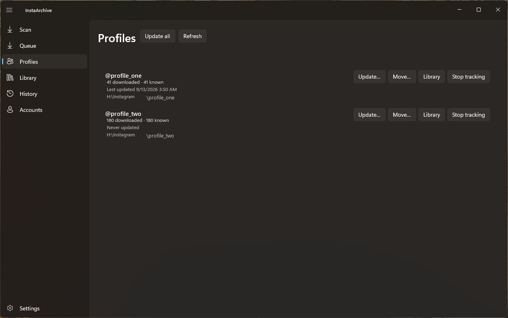
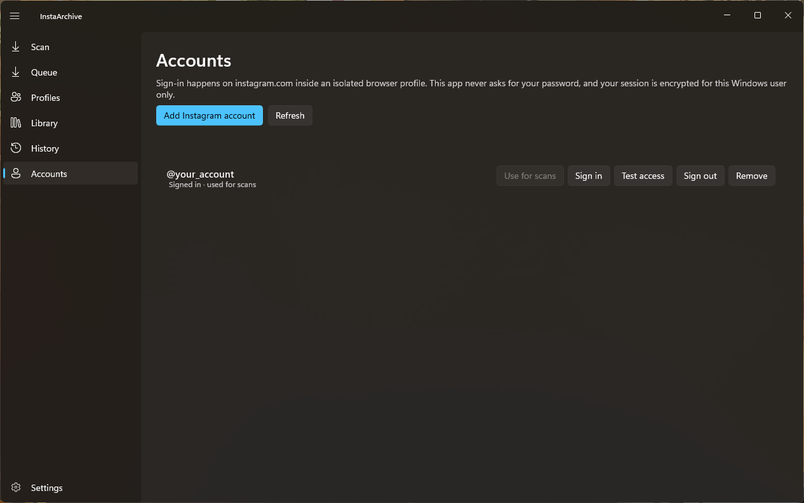
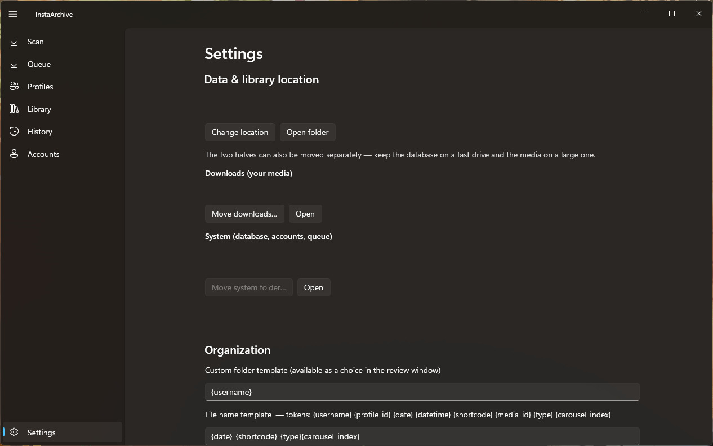

# InstaArchive

Save Instagram photos and videos to your own PC, and keep them organised.

InstaArchive is a Windows app. You sign in to Instagram once, through Instagram's own login page. After that you paste a link or a username, press Scan, tick what you want, and it downloads. Your files land in normal folders that you can open, copy and back up like any other folder.

Windows 10 build 17763 or newer, 64-bit. Windows 11 supported.

This repository holds the **downloads only**. There is no source code here.

---

## Start here

### 1. Get it

Everything is on the [Releases page](../../releases). Pick one:

| File | What it is |
|---|---|
| `InstaArchive-<version>-setup-x64.exe` | Installer. Run it. Updates in place over a previous install. |
| `InstaArchive-<version>-portable-x64.zip` | Portable. Unzip anywhere and run `InstaArchive.App.exe`. Nothing is installed and everything stays in that folder, so it works from a USB stick. |
| `SHA256SUMS.txt` | Checksums, if you want to verify what you downloaded. |
| `BUILD.txt` | The version and the exact source commit it was built from. |

These are **beta** builds and they are **unsigned**, so Windows SmartScreen will warn you the first time. That warning means nobody has paid for a code-signing certificate, not that something is wrong with the file. To check the download yourself:

```powershell
Get-FileHash .\InstaArchive-<version>-setup-x64.exe -Algorithm SHA256
```

and compare it to the line in `SHA256SUMS.txt`.

### 2. Sign in

Open the **Accounts** tab and click **Add Instagram account**. Instagram's real login page opens in a window. Log in the way you normally would, including any code it sends you.

The app never asks for your password and never sees it. It keeps the browser session instead, encrypted, and only for this Windows user on this PC.

You only do this once.

### 3. Download something

1. Go to **Scan**.
2. Paste an Instagram link, or a username like `@nasa`. You can paste a whole list at once.
3. Click **Scan**. The app looks up what is there and tells you what it found.
4. Click **Download** to take all of it, or **Review & select...** to look through the pictures and pick.
5. Watch it run on the **Queue** tab.

That is the whole thing. Everything below is detail.

---

## What each tab does

Screenshots are small here. Click any one to open it full size.

### Scan

<a href="docs/screenshots/scan.png"></a>

This is where you tell the app what you want.

Paste into the big box. It takes a post link, a reel link, a username, or hundreds of them on separate lines. **Import .txt** reads a list from a file, and you can drag a `.txt` file straight onto the window. **Clear** empties the box.

**Scan** looks everything up without downloading. You get a summary first: how many posts, how many reels, how many you already have, and roughly how big the rest is. Nothing is downloaded until you say so.

Then either:

- **Download** takes everything the scan found.
- **Review & select...** opens a window of thumbnails. Click a picture to select it, drag across several to select a run of them, and Shift-click to select everything between two. Selected pictures get a green outline and a green tick. There are filters along the top for images, videos, reels and carousels, and a **New only** filter for things you do not already have.

When a scan is finished with, **Clear** on the results puts the page back to empty.

### Queue

<a href="docs/screenshots/queue.png"></a>

Everything waiting to download, and everything downloading right now.

**Pause downloads** stops without losing your place. **Resume downloads** carries on. If something failed, **Retry failed** has another go at all of it, or select the ones you want and use **Retry selected**.

Half-finished files are kept as `.part` files, so if the app closes mid-download it picks up where it stopped instead of starting the file over.

The line at the top counts how many requests have been made to Instagram this hour. The app keeps itself under a sensible limit so you are not hammering the site.

### Profiles

<a href="docs/screenshots/profiles.png"></a>

Every account you have downloaded from, with how many files you have and where they are kept.

- **Update...** checks that profile for anything posted since last time, and lets you choose what to look for. Only new things are fetched.
- **Update all** does that for every profile in the list.
- **Move...** puts a profile's files somewhere else, or points the app at a folder you already moved yourself.
- **Library** jumps to that profile's files.
- **Stop tracking** removes the profile from this list. It does not delete anything. The files stay where they are and so do the library entries. All it means is that **Update all** will skip that profile from now on. Add it back any time by scanning it again.

### Library

Everything you have downloaded, in one searchable list.

Search by username, caption or shortcode. Filter by images, videos, reels or carousels. Sort by when it was posted, when you downloaded it, or by username. Pick one profile from the dropdown, or show the whole library at once.

Click any item for **Open file**, **Show in folder**, **Open Instagram page**, and its **Metadata**. You can also remove an entry from the library, or delete the file from the disk. Those two are deliberately separate, so tidying a list can never lose you a file.

**Export JSON** and **Export CSV** write out whatever the current filter is showing.

### History

A plain log of what the app has done: scans, updates and downloads, each with a time, whether it worked, and what it was. Useful when you want to know why something did or did not happen.

### Accounts

<a href="docs/screenshots/accounts.png"></a>

Your Instagram sign-in lives here. You can add more than one and switch between them.

- **Use for scans** picks which account the app browses as.
- **Sign in** reopens Instagram's login page, which is what you want when a session has expired.
- **Test access** makes one real request to check the session still works.
- **Sign out** drops the session but keeps the account in the list.
- **Remove** deletes the account and its saved session.

Sessions do not travel between PCs or between Windows users. Windows encrypts them for one user on one machine. Copy your library to another PC and everything comes with it except the sign-in, which you redo there.

### Settings

<a href="docs/screenshots/settings.png"></a>

The part worth knowing is at the top: **Data & library location**, which is where all your files live.

**Change location** moves the lot. You can also move the two halves separately, which is handy if you want the app's database on a fast drive and the media on a big one. Moves are verified and can be resumed, and nothing is deleted until the copy is confirmed.

Further down you control how files are named and foldered, using tokens like `{username}`, `{date}` and `{shortcode}`. There is also an update check, which stays off unless you turn it on. When it is on it reads a version number from this page and tells you if there is a newer one. It never downloads or installs anything by itself.

---

## Where your files go

By default: `C:\Users\<you>\Downloads\InstaArchive`

Inside it there are two folders:

```
Downloads/     your pictures and videos, and nothing else
System/        the app's own files: database, settings, queue, sign-in
```

`Downloads` is yours. Nothing in it is a special format, nothing is bundled into one big container file, and you do not need InstaArchive to open any of it. Copy it, sync it, back it up, move it to another drive.

Portable copies keep all of this in a `Data` folder next to the program instead.

Uninstalling the app does not touch your files.

---

## Updating

Updates replace the program only. They have no way to write into your data at all, so an update cannot delete your downloads, forget your settings, empty your queue, or sign you out.

If a new version does need to change something inside an existing library, it does that once on first launch and records that it succeeded. If it gets interrupted, it runs again next time rather than being skipped.

For portable copies, extract the new version and run `Update existing portable.cmd` from it, then point it at your existing folder. Program files are replaced and your `Data` folder is left alone.

---

## Questions people actually ask

**Does it need my Instagram password?**
No. You log in on Instagram's own page, and the app keeps the session, not the password.

**Can I download private accounts?**
Only the ones your signed-in account can already see. The app has exactly the access you have, and nothing more.

**Will it download the same photo twice?**
No. Media is matched by Instagram's own ID for it, not by filename, so renaming or moving files does not confuse it.

**What if a download fails halfway?**
It resumes. Links from Instagram expire after a while, and when that happens the app fetches a fresh link rather than marking the file failed.

**Is anything sent anywhere?**
No. No telemetry, no analytics, no ads, no crash reporting. Session cookies and tokens are stripped out of the logs, and out of the diagnostic text in Settings.

**Do I have to keep it running?**
Only while it is downloading. Pause and resume whenever you like. Close it mid-download and the queue is still there next time.

**Why does SmartScreen warn me?**
The builds are unsigned. Click More info, then Run anyway, or verify the checksum first using the command further up.

---

## Known limits

- Instagram has no public API for this, so the app makes the same web requests the site itself makes. Those change from time to time, and when they do, downloading needs a fix on our side.
- Stories and highlights need a signed-in account that already has access to them.
- Instagram sometimes returns fewer photos in a carousel than it says exist. The app tries twice by different routes, keeps whatever it gets, carries on with the rest, and marks that post incomplete so you can retry it later.
- Reels currently come back at a lower resolution than posts, because the better route is restricted.
- Instagram only. No TikTok, X or Reddit.
- Proxy support is one optional HTTP/HTTPS proxy.

Screenshots on this page use placeholder names in place of real accounts.

---

## Licence

MIT.
